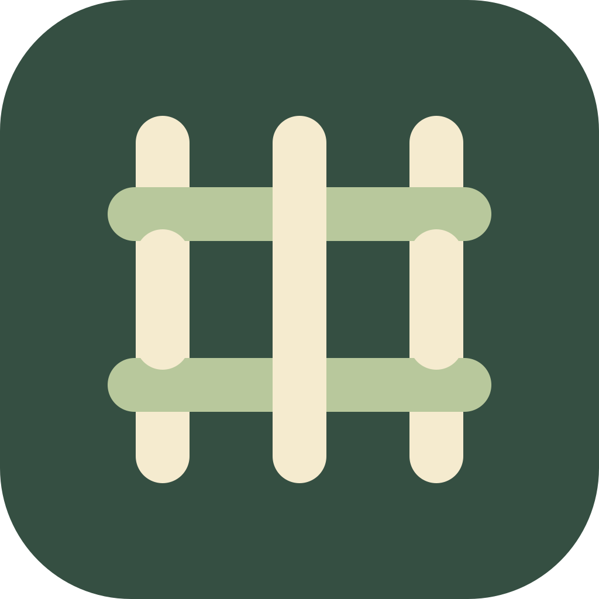
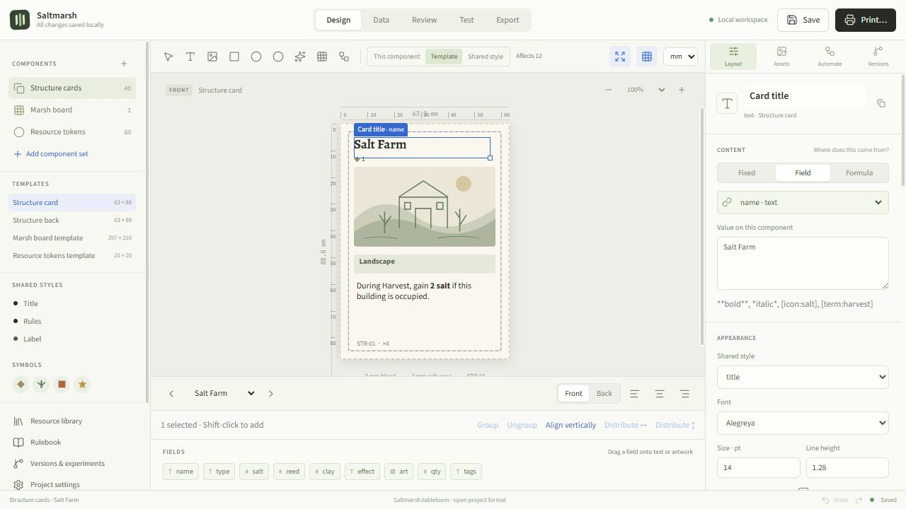
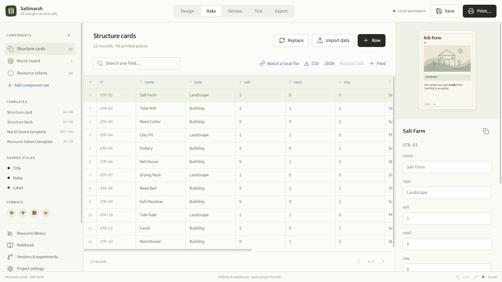
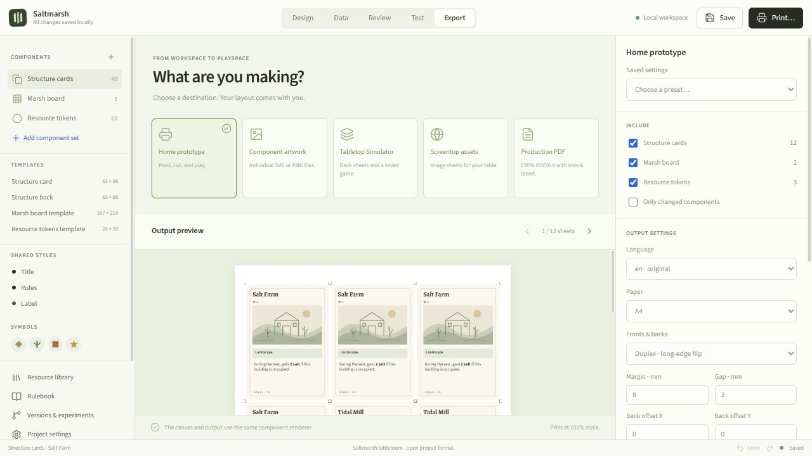

<p align="center"></p>

<h1 align="center">Tableloom</h1>

<p align="center">A desktop workspace for designing, playtesting, and printing tabletop games.</p>

<p align="center">
  <a href="https://github.com/oipoistar/tableloom/releases/latest"><strong>Download for Windows</strong></a>
  &nbsp;·&nbsp;
  <a href="#start-a-project">Getting started</a>
  &nbsp;·&nbsp;
  <a href="#development">Development</a>
</p>



Tableloom keeps your templates, component data, artwork, rules, and playtest notes in one place. Edit a shared layout, see the change across your cards, then test it on the table or print a new prototype.

Projects live on your device. Authoring and standard exports work offline, without an account. A `.tableloom` file contains the editable project, its artwork, and saved versions.

## Download

Open the [latest release](https://github.com/oipoistar/tableloom/releases/latest) and choose a Windows x64 download:

| Download | Use it when… |
| :--- | :--- |
| **Setup.exe** | You want an installed app with shortcuts and an uninstaller. |
| **Portable.exe** | You want to run Tableloom without installing it. |
| **SHA256SUMS.txt** | You want to verify a download’s checksum. |

This is an early release. Windows builds are unsigned. macOS and Linux packaging is configured in the source; tested downloads are currently available for Windows.

## Start a project

1. Open a starter from Home, or choose **New project**.
2. Add your cards, tokens, tiles, boards, player aids, or packaging.
3. Connect text and artwork to fields. Use **Template** for shared changes or **This component** for an individual variation.
4. Open **Review** to check the layout, then **Test** to try it or **Export** to print it.
5. Save a portable `.tableloom` file with **Ctrl+S**. Tableloom also keeps local recovery copies as you work.

Six original starters are included: **Saltmarsh**, **Orchard Market**, **Wanderlands**, **Little Machines**, **Pocket Treasury**, and **Field Notes**.

## From design to table

| Workspace | What you can do |
| :--- | :--- |
| **Design** | Build front and back templates with text, images, symbols, repeaters, shared styles, and measured layouts. |
| **Data** | Edit component records, paste spreadsheet ranges, import CSV/TSV, JSON, or ODS, and use formulas and child tables. |
| **Review** | Find overflowing text and missing assets, compare saved versions, and identify changed components. |
| **Test** | Drag, flip, rotate, group, draw, discard, and retrieve pieces. Use player areas, counters, layered layouts, saved setups, and notes. |
| **Export** | Create print sheets, SVG/PNG artwork, deck sheets, and production files. Save presets for the next revision. |

### Data that stays connected

Edit names, costs, quantities, and rules alongside a live component preview. Changes flow into the linked layout.



### Print a prototype

Preview sheets, pair card backs, set duplex offsets, and add crop marks. Desktop builds write PDFs directly; browser previews download a print document.



The playtest table is manual: players resolve game rules and outcomes. Tabletop Simulator and Screentop exports provide files for import; there is no account publishing integration. Production PDF/X-4 conversion requires a separately installed Ghostscript executable and your printer’s CMYK profile. See [printing](docs/PRINTING.md).

## Updates

Tableloom checks GitHub at startup and every six hours. When a newer release is ready for your platform, a notification opens its release page. Download and install it when you’re ready.

Use **Updates** in the app to check manually or turn automatic checks off. While the repository is private, sign in with `gh auth login`, or save a token with **Contents: read** access in update preferences. Saved tokens are encrypted on the device. No project content is sent during a check.

## Development

Built with **Electron**, **Vue 3**, and **TypeScript**. The editor, CLI, and exports share the same SVG document engine.

Use Node.js **22.12 or later**:

```sh
git clone https://github.com/oipoistar/tableloom.git
cd tableloom
npm ci
npm run desktop
```

| Command | Purpose |
| :--- | :--- |
| `npm run dev` | Browser development preview |
| `npm test` | Engine, workflow, collaboration, and update tests |
| `npm run format:check` | Source formatting |
| `npm run build` | Type checks and production renderer |
| `npm run test:desktop` | Native PDF and desktop startup checks after building |
| `npm run dist:win` | Windows x64 installer and portable app |

GitHub Actions runs source checks and builds Windows downloads. A version tag such as `v0.1.1` publishes the tested files to Releases. See [release instructions](docs/RELEASING.md).

**Further documentation:** [Architecture](docs/ARCHITECTURE.md) · [Printing](docs/PRINTING.md) · [CLI & extensions](docs/EXTENSIONS.md) · [Self-hosted collaboration](docs/COLLABORATION.md)

## License

Code is licensed under [Apache 2.0](LICENSE). Original starter artwork is CC0-1.0. Bundled fonts retain their SIL Open Font License; see [third-party notices](docs/THIRD_PARTY.md).
